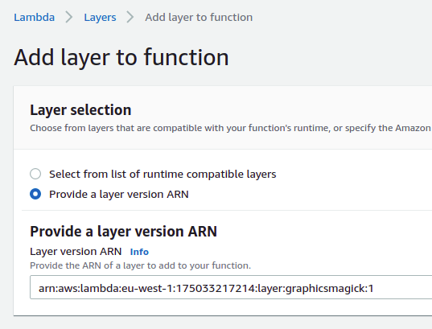

# gm-lambda-layer

AWS Lambda layer with GraphicsMagick binaries.

## Usage

Click on Layers and choose `Add a layer`, and `Provide a layer version ARN` and enter the following ARN (replace eu-west-1 with the region of your Lambda):

```
arn:aws:lambda:eu-west-1:175033217214:layer:graphicsmagick:2
```



## Version ARNs

| GraphicsMagick version | ARN |
| --- | --- |
| 1.3.31 | `arn:aws:lambda:<region>:175033217214:layer:graphicsmagick:2` |

## Available Regions

- `ap-northeast-1`
- `ap-northeast-2`
- `ap-south-1`
- `ap-southeast-1`
- `ap-southeast-2`
- `ca-central-1`
- `eu-north-1`
- `eu-central-1`
- `eu-west-1`
- `eu-west-2`
- `eu-west-3`
- `sa-east-1`
- `us-east-1`
- `us-east-2`
- `us-west-1`
- `us-west-2`
